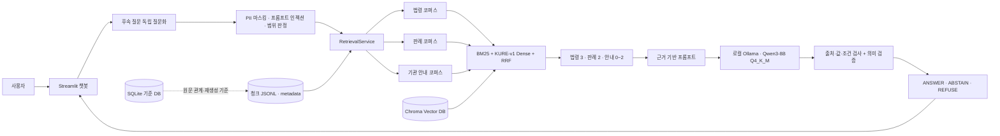
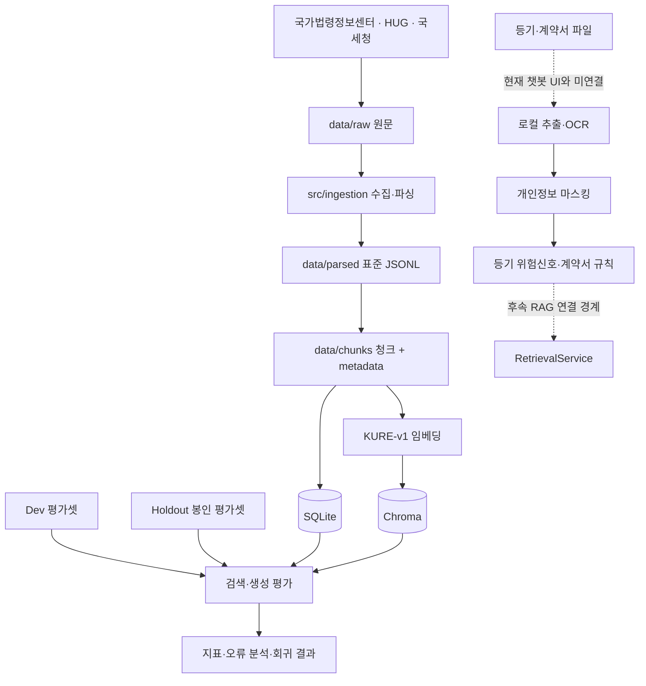

# `4팀_시스템_아키텍처.pdf` 기획틀

## 1. 산출 형태

한 장에 무리하게 넣지 않고 2쪽 PDF를 권장한다.

- 1쪽: 전체 시스템과 사용자 질의 흐름
- 2쪽: 데이터 수집·인덱싱·평가·보안 흐름

각 페이지 하단에 프로젝트명, 4팀, 기준 커밋, 작성일을 표시한다. 구현 완료 구성은 실선,
후속 연결 또는 제한 사항은 점선으로 표시한다.

## 2. 1쪽 — 런타임 아키텍처

### 핵심 흐름

### 그림에 반드시 표시할 값

- 임베딩: `nlpai-lab/KURE-v1`, 1024차원
- 검색: 법령·판례·안내 코퍼스 분리, BM25 + Dense, RRF
- 생성: 로컬 Ollama, Qwen3-8B Q4_K_M, `temperature=0`, `max_tokens=256`, `num_ctx=4096`
- 반환: 법령 상위 3건, 판례 상위 2건, 안내 조건부 0~2건
- 검증: citation/value/condition 검사 후 semantic judge
- 출력 정책: 답변·보류·범위 밖 거절

## 3. 2쪽 — 데이터·평가·문서 처리 아키텍처

## 4. 컴포넌트 설명 표

| 계층 | 컴포넌트 | 역할 | 코드 근거 |
| --- | --- | --- | --- |
| UI | Streamlit | 대화·상태·출처 표시 | `app/streamlit_app.py` |
| 안전 | PII/Injection/Scope | 개인정보 및 범위 밖 질문 차단 | `src/document_check/privacy.py`, `src/security/`, `generation/abstention.py` |
| 검색 | RetrievalService | 코퍼스 라우팅과 근거 반환 | `src/retrieval/service.py` |
| 검색 | Hybrid Retriever | BM25·Dense·RRF 결합 | `src/retrieval/hybrid.py` |
| 저장 | SQLite | 원문 관계와 재생성 기준 데이터; 현재 질의 경로가 직접 조회하지 않음 | `src/database/` |
| 저장 | Chroma | 임베딩 벡터와 검색 인덱스 | `src/database/vector.py`, `src/retrieval/dense.py` |
| 생성 | Qwen3/Ollama | 근거 기반 답변 생성 | `src/generation/llm.py`, `prompt.py`, `chain.py` |
| 검증 | 결정론+의미 검증 | 근거 밖 인용·값·조건 오류 차단 | `src/generation/citation.py`, `validation.py` |
| 평가 | Dev/Holdout | 검색·생성 회귀 측정 | `src/evaluation/`, `data/eval/` |

## 5. 그림 작성 시 주의사항

- 기관 안내는 법령과 같은 법적 근거로 표시하지 않는다.
- SQLite와 Chroma의 역할을 “기준 데이터”와 “재생성 가능한 검색 인덱스”로 구분한다.
- LangGraph는 현재 실행 흐름에 실제 사용되지 않으므로 런타임 구성처럼 그리지 않는다.
- OCR·문서 점검 백엔드는 코드가 있지만 PR #17 챗봇 화면과 직접 연결되지 않았음을 표시한다.
- 외부 OpenAI API를 사용하는 구조로 그리지 않는다. PR #17 생성 경로는 로컬 Ollama다.
- 평가 흐름에서 Dev 튜닝과 Holdout 최종 확인을 분리한다.

## 6. 제작·검수 체크리스트

- [ ] 1920×1080 이상 원본 또는 벡터 기반 제작
- [ ] 작은 글씨도 A4 PDF에서 읽을 수 있음
- [ ] 화살표 방향과 데이터 흐름 일치
- [ ] 현재 구현/후속 계획 범례 표시
- [ ] 모델·DB·검색 파라미터가 최종 코드와 일치
- [ ] PNG로도 한 번 렌더링해 깨짐 확인
- [ ] 팀원 코드 담당자 1명, 데이터 담당자 1명 교차 검수
